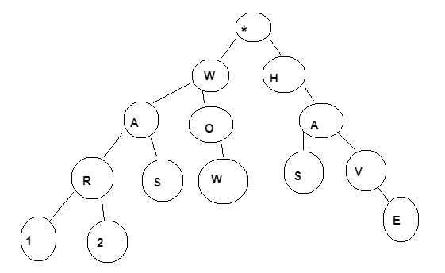
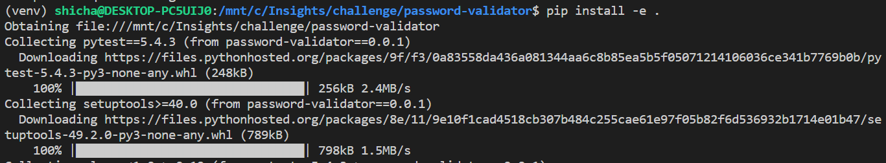
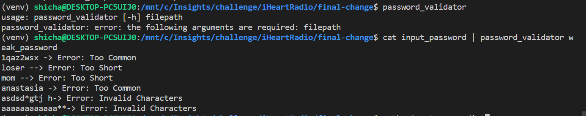
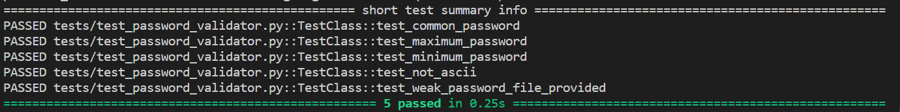

## Background 

NIST recently updates their Digital Identity Guidelines in June 2017. The new guidelines specify general rules for handling the security of user supplied passwords. Previously passwords were suggested to have cer## Background 

NIST recently updates their Digital Identity Guidelines in June 2017. The new guidelines specify general rules for handling the security of user supplied passwords. Previously passwords were suggested to have certain composition rules (special characters, numbers, etc), hints and expiration times. Those have gone out the window and the new suggestions are as follows: Passwords MUST

1. Have an 8 character minimum
2. AT LEAST 64 character maximum
3. Allow all ASCII characters and spaces (unicode   optional)
4. Not be a common password

```
cat input_passwords.txt | ./password_validator weak_password_list.txt
mom -> Error: Too Short
password1 -> Error: Too Common
*** -> Error: Invalid Charaters
```

The program should accept passwords from STDIN in newline delimited format and print invalid passwords to the command line

Asterixes used to print unprintable characters

## Analyzing different available data structures and selecting the one which is efficient(Trie)

1. List 

List is a dynamic data structure in which elements can be added or removed linearly. Searching a list involves O(n) time complexity. 
We are not going with list apprach because iterating through the elements would mean going through each of the weak password in the file to check if the password exists or not. Hence, it could turn out to be time intensive process with a time complexity of O(nm)

2. HashSet 

The second approach could have been to represent the passwords in the weak password file in the form of set. In this case, hashes would be created for every password and saved in the memory. Hashes are computed even for almost similar words - like War, War1. Hashing is a good way to approach the problem but the hashset can't grow more than the memory. Another approach could have been to break down the file in smaller chunks and then perform parellel processing on multiple servers but that would have gone out of the scope of the problem. The problem provided an ideal opportunity to use Trie, the next approach discussed below.

3. Tries

The solution used for this assessment leverages the Trie data structure. Trie is a special tree capable of storing sequence of values in such a way that tracing the path from root to any node yields an entire string. 

Trie works on the concept of first buiding a tree and then searching through the tree. If we are storing lots of words that start with similar patterns, tries may reduce the overall storage cost by storing shared prefixes once. The biggest advantage of using a trie is that we can save a lot of space while adding a character in a Trie. Next time, we only add a character which is not present in the prefix. 



### Requirement

Python 3+ 

### Installation 

Run `pip install -e .` from the root folder 



The above command will install a package for the password_validator tool in developer mode.

In order to install it in production mode, please run `pip install .` 

### Usage 

```
cat input_password | password_validator weak_password
1qaz2wsx -> Error: Too Common
loser --> Error: Too Short
mom --> Error: Too Short
anastasia -> Error: Too Common
asdsd*gtj h-> Error: Invalid Characters
aaaaaaaaaaaa**-> Error: Invalid Characters
```



In order to create a zipped distribution package, please run `python3 setup.py sdist`

### Test Cases

`pytest` library has been used to test the inputs. 

  

 From the root folder, you can run `pytest` or `pytest -rA` to get the test result with individual checks 


### Future enhancements 

The future steps could be to create an image out of the executable and run it within a `Docker` container. As of now, the containerziation part works partially. To make containerization work completely, would need some more time and that might go beyond the submission deadline. Therefore, I did not include it in this version 

