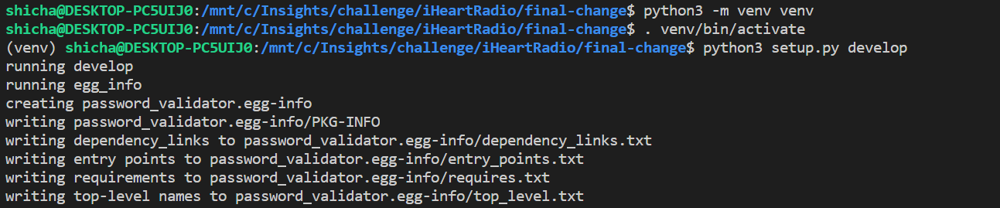

## Background 

NIST recently updates their Digital Identity Guidelines in June 2017. The new guidelines specify general rules for handling the security of user supplied passwords. Previously passwords were suggested to have certain composition rules (special characters, numbers, etc), hints and expiration times. Those have gone out the window and the new suggestions are as follows: Passwords MUST

1. Have an 8 character minimum
2. AT LEAST 64 character maximum
3. Allow all ASCII characters and spaces (unicode   optional)
4. Not be a common password

```
cat input_passwords.txt | ./password_validator weak_password_list.txt
mom -> Error: Too Short
password1 -> Error: Too Common
*** -> Error: Invalid Charaters
```

The program should accept passwords from STDIN in newline delimited format and print invalid passwords to the command line

Asterixes used to print unprintable characters

### Requirement

Linux  
Python 3+ 

### Installation 

Run `python3 setup.py develop` from the root folder 



The above command will create a package for the password_validator tool 

### Usage 

```
cat input_password | password_validator weak_password
1qaz2wsx-> Error: Too Common
mom -> Error: Too Short
*******-> Error: Invalid Charaters
```


If running on windows, its recommended to install a python virtual environment

Run `python3 -m venv venv` to install virtual environment 

Run `.venv/bin/activate` to enable the virtual environment

In order to create a zipped distribution package, please run `python3 setup.py sdist`

### Test Cases

`pytest` library has been used to test the inputs. 

  

 From the root folder, you can run `pytest` or `pytest -rA` to get the test result with individual checks 

## Analyzing different available data structures and selecting the one which is efficient(Trie)

1. List 

List is a linear dynamic data structure in which elements can be added or removed linearly. This addition and removal involved O(n) time complexity. 

Iterating through the rows would mean going through each of the 1 billion rows in the file to check if the password exists or not. Hence, it could turn out to be time intensive process

2. HashSet 

The second approach could have been to represent the passwords in the weak password file consisting of 1 billion rows, in the form of set. In this case, hashes would be created for every password and saved in the memory. Hashes are computed even for almost similar words - like War, War1. Hashing is a good way to approach the problem if the file size is small. However, if the size starts increasing, it could be costly on memory

3. Tries

The solution used for this assessment leverages the Trie data structure. Trie is a special tree capable of storing sequence of values in such a way that tracing the path from root to any node yields an entire string. 

Trie works on the concept of first buiding and then searching. The available texts or words are first converted into a trie. This phase is called building the trie. If we are storing lots of words that start with similar patterns, tries may reduce the overall storage cost by storing shared prefixes once. The biggest advantage of using a trie is that they save the prefixes of words and when a particular word is queried, only those characters are checked that are diffrent than the prefix, instead of checking every character of the word during every search.


### Future enhancements 

The future steps could be to create an image out of the executable and run it within a `Docker` container. As of now, the containerziation part works partially. To make containerization work completely, would need some more time and that might go beyond the submission deadline. Therefore, I did not include it in this version 


